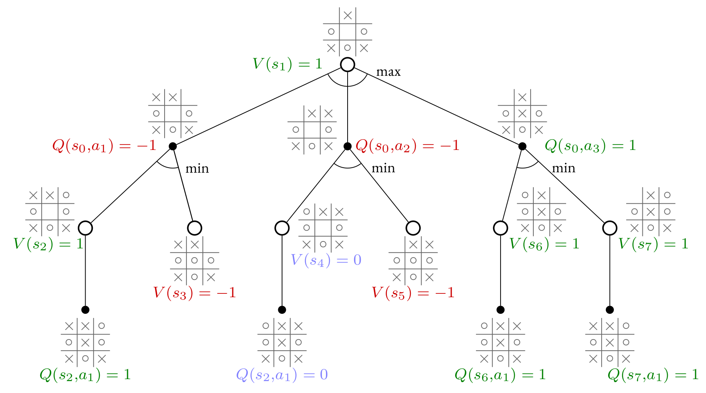

# RL and Advanced DL: Домашнее задание 2

Второе домашнее задание опять посвящено игре; его базовая часть, надеюсь, не слишком
большая, но я добавил опциональную часть, которая, думаю, должна быть достаточно
интересной для любого слушателя. Как обычно,в качестверешения ожидается ссылка
на jupyter-ноутбук на вашем github (или публичный, или с доступом для snikolenko);
ссылку обязательно нужно прислать в виде сданного домашнего задания на
портале Академии. Любые комментарии, новые идеи ирассуждения на тему, как всегда,
категорически приветствуются.

> 

## Часть первая: крестики-нолики при помощи Q-обучения

В коде, прилагающемся к последней лекции про обучение с подкреплением, реализован
Environment для крестиков-ноликов, в котором можно при инициализации указывать
разные размеры доски и условия победы, а также функции для рисования, в том числе с
указанием оценки различных действий. С этим окружением все задания и связаны.

1. Реализуйте обычное (табличное) Q-обучение. Обучите стратегии крестиков и
    ноликов для доски 3х3.
2. Попробуйте обучить стратегии крестиков и ноликов для доски 4х4 и/или 5х5.

Disclaimer: начиная с пункта 2, задания для досокразмера больше 4х4 могут потребовать
большого терпения или более сложных вычислительных реализаций (например,
параллелизации). Не хочу в этом задании непременно требовать ни того ни другого, так
что если не будет получаться доучить до победных стратегий, не страшно -- но покажите,
что со временем что-то всё-таки улучшается.

## Часть вторая: добавим нейронных сетей

Реализуйте нейронную сеть для метода DQN на доске для крестиков-ноликов. Не буду
ограничивать фантазию, но кажется, что свёртки 3х3 здесь должны неплохо работать (в
том числе обобщаться на доски размера побольше).

3. Реализуйте DQN с нейронной сетью, обучите стратегии крестиков и ноликов.
    Замечание: скорее всего, experience replay потребуется сразу же.
4. Реализуйте Double DQN и/или Dueling DQN.

## Часть третья: расширим и углубим поиск

Крестики-нолики -- это, конечно, далеко не го, и обычный альфа-бета поиск с отсечением
здесь наверняка может работать идеально вплоть до довольно больших досок. Однако мы
всё-таки для этого учебного задания будем реализовывать более практически
релевантный метод MCTS -- заодно фактически получится и упражнение на многоруких
бандитов.

5. Реализуйте rollouts со случайной стратегией и (опционально) rollouts с неслучайной,
    но простой стратегией (например, основанной на дополнении нескольких паттернов
    или на Q-функции, которая у вас получилась в первом пункте).
6. Реализуйте MCTS-поиск с этими rollouts для крестиков-ноликов на досках разного
    размера, сравните полученные стратегии между собой и со стратегиями,
    обученными в первых двух частях.

## Часть четвёртая, опциональная: AlphaZero

В опциональной части домашнего задания давайте попробуем всё-таки собрать всё
вместе и завести настоящий AlphaZero. Если получится и будет обобщаться на большие
доски, будет очень круто и будет стоить много дополнительных баллов.

7. Реализуйте AlphaZero для крестиков-ноликов, используя MCTS из третьей части и
    DQN-сеть из второй части. Обучите стратегии для игры на больших досках (10х10 и
    выше, до пяти в ряд; опять же, может потребовать много времени, так что
    достаточно показать, что обучение началось и идёт).

